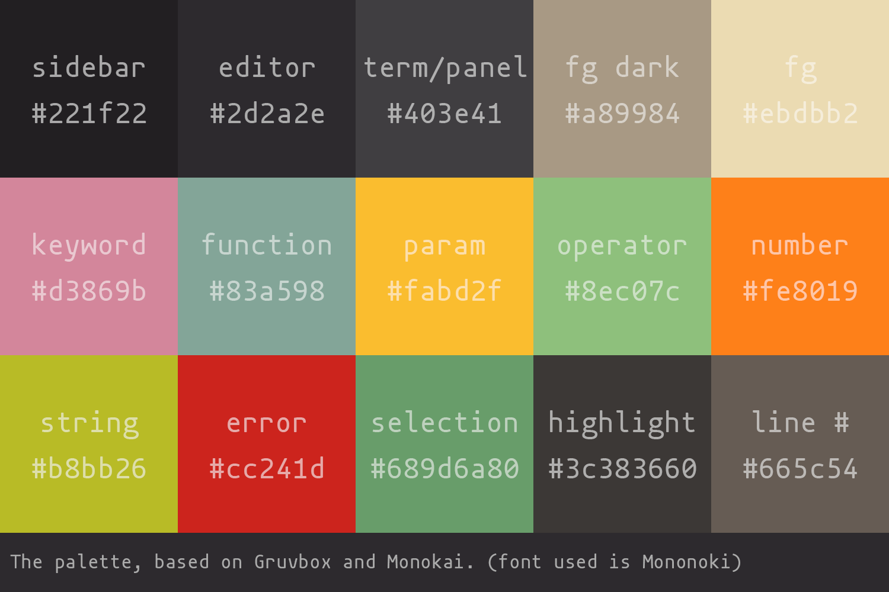

## Gourd
### The warm colors of Gruvbox and Monokai, with a relaxing contrast inspired by Nord.



##### Requirements:
- Treesitter (technically optional, but highly recommended)

Example installation (for packer.nvim):
```lua
use "zorbn/gourd.nvim"

-- Later, in your init.lua
vim.cmd("colorscheme gourd")
```

